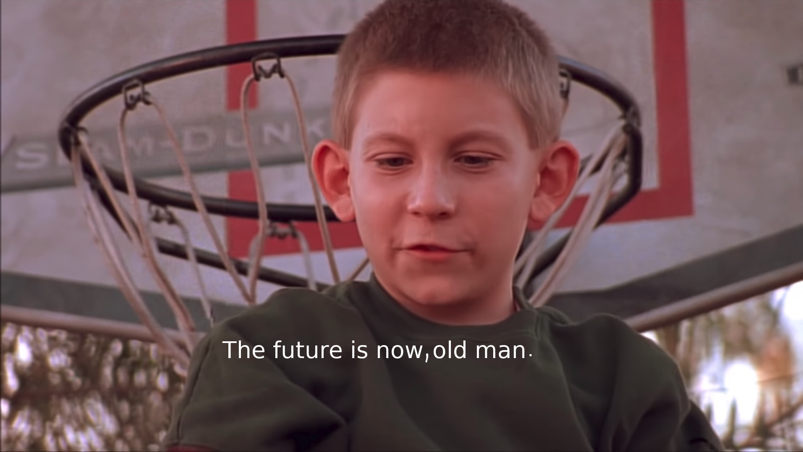
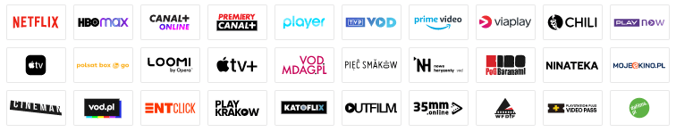
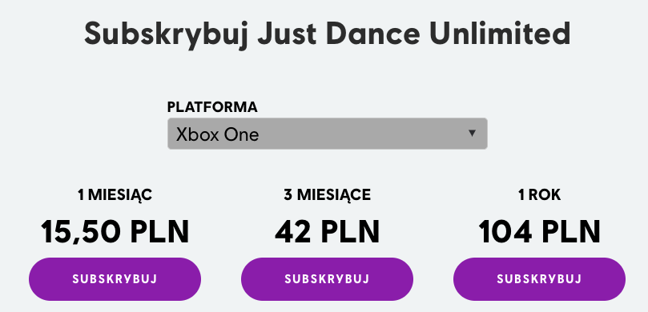
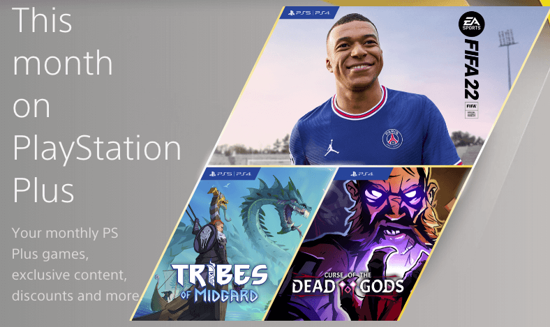
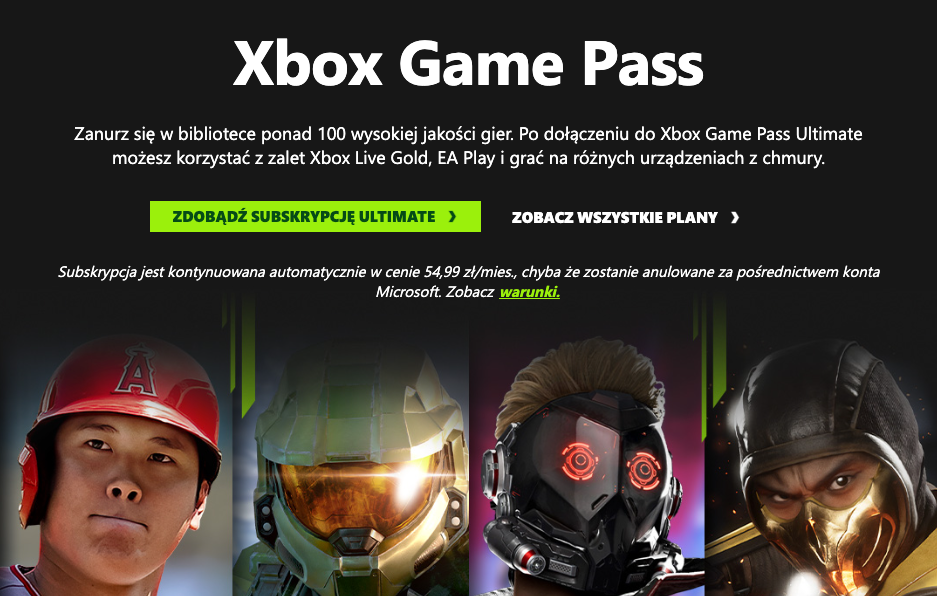

Subskrypcje są nieodłączną częścią naszego codziennego życia. Opłacamy ich często więcej niż chcemy się do tego przyznać, albo co gorsza więcej niż pamiętamy, że opłacamy.

Ale czym tak na prawdę jest subskrypcja? Gdy zapyta się Słownik PWN to mimo niezwykłej wylewności, bo zaledwie 144 znaków, dostajemy całe niezbędne mięso, by zrozumieć to zagadniecie. 

> subskrypcja - pisemne zobowiązanie się do wykupienia książki albo do nabycia akcji, obligacji lub innych papierów wartościowych, połączone często z przedpłatą

Ten opis nie pasuje idealnie do cyfrowych realiów, ale mimo wszystko można z niego wyciągnąć coś pożytecznego. Wiemy, że jako konsument, zobowiązujemy się opłacać coś, by dostać dostęp do czegoś. Używając przykładu, co trafi do wszystkich - opłacam Netflix’a, by móc oglądać nowy sezon Bridgertonów. W tych czasach subskrypcja wykracza poza dobra cyfrowe i chyba już każda kategoria z naszego życia może być przez jakąś rozszerzona.

## Subskrypcje na wszystko

Obecnie chyba każda nasza potrzeba zostanie zrealizowana przez jakiś portal, który po opłaceniu subskrypcji, zapewni nam jakąś usługę czy produkt. A jak tak nie jest, to pewnie w trakcie pisania tego artykułu, właśnie powstaje. Nie wierzycie? To lecimy z paroma mniej oczywistymi przykładami:

1. Comiesięczne dostawy środków by męskie jądra pięknie pachniały - bam! [Manscaped](https://www.manscaped.com/).
2. Świeże dostawy akcesoriów do palenia trawki - dzięki ludkom z [Cannabox](https://www.cannabox.com/) już się nie musisz o to martwić.
3. Zmęczony ciągłymi wyprawami do sklepu po papier do tyłka - dzięki [Cloudpaper](https://cloudpaper.co/) problem z głowy.

I takich przykładów jest wuchta. Mam nadzieje, że rozumiecie o co mi chodzi; jest tego dużo i ciągle tego przybywa.

## Branża filmowa

Ale to co mnie osobiście psychicznie i czasem też fizycznie boli to jest fakt, że firmy zaczęły przesadzać z tym wciskaniem tego modelu płatności do każdej możliwej usługi. Netflix miał być rycerzem w złotych kaloszach, który uwolni nas od jarzma standardowej nudnej, pełnej reklam telewizji. Bez wątpienia tak było na początku. Wchodziło się na portal i cyfrowe półki były zapełnione po brzegi filmami oraz serialami do oglądania, można przerwać seans i do niego wrócić, napisy w różnych językach. Po prostu magia! Tak żyć to ja lubię.

ALE ta sielanka nie trwała długo, bo duże wytwórnie podpatrzyły jakie góry monetek robi Netflix i też chciały troszkę tego hajsiwa dla siebie. Zaczęło się cudowne wycinanie siekierami i strasznymi umowami produkcji tylko po to, by móc ją potem obejrzeć na ich nowej, super świetnej platformie - innej niż każda inna do tej pory na rynku. No i tak wylądowaliśmy w świecie, w którym by obejrzeć wszystkie 3 części jakiegoś filmu trzeba mieć wykupione 3 różne platformy. No to jest paranoja. Nie po to człowiek przestaje opłacać kablówkę, by zacząć opłacać 3/4 albo i więcej usług, tylko by raz w tygodniu legnąć jak styrany ziemniak na kanapie i obejrzeć jeden film.

Robiąc bardzo szybki research (całe 30 sec), na samym filmwebie można filtrować po 30 platformach VOD/streamingowych. To chyba lekka przesada… Z drugiej strony, każda platforma stara się specjalizować w czymś innym. Gdyby człowiek miał opłacać to wszystko, chyba musiałby sprzedać nerkę.

## Branża aplikacji mobilnych

Żeby nie było - nie tylko branża filmowa jest tą złą i niedobrą. Chciałbym byście wyjęli telefon z kieszeni (jeśli czytasz to na telefonie, to schowaj go i wyjmij jeszcze raz). Przejdźcie do ulubionego sklepiku z aplikacjami i popatrzcie na aplikacje “free”. Często posiadają taki cudowny dopisek ”Zawiera płatności w aplikacji” lub coś podobnego. W 70% przypadków sprowadza się to do tego, że korzystanie z aplikacji jest możliwe tylko po zalogowaniu i podpięciu gdzieś karty kredytowej. Potem cyfrowy wampir może wyssać z Ciebie 5$ miesięcznie, czy ile tam wyceni się dany deweloper. Piszę 70%, a nie więcej, bo dużo gier ma mikropłatności, co są rakiem samym w sobie. Szkoda jednak na nie cyfrowego tuszu dlatego więcej o nich nie będzie. 

Ja rozumiem, że wytwarzania oprogramowania to nie jest łatwy i tani biznes. Serwery kosztują miesięcznie pokaźne góry korpodolarów, ale czy aby na pewno aplikacja ładnego budzika potrzebuje subskrypcję? I to tylko po to, by móc zmieniać dzwonki i kolorki w tle. Co się stało z taką cudowną opcją jak “Kup raz i korzystaj do usranej śmierci”? 

## Branża gier

W końcu nadszedł czas, by wspomnieć o branży, która jest najbliższa mojemu serduszku -cudowna branża gier - w której nigdy nie ma żadnych skandali i każdy jest dla siebie miły oraz życzliwy. Dla pewnej części ludzi to co zamierzam napisać jest po prostu niewyobrażalne i zakrawa o świętokradztwo. Obecnie znajdujemy się w dziewiątej generacji konsol i jak zapewne wiecie, by móc robić piu piu ze znajomymi przez internety to trzeba opłacić subskrypcję. Dostaje się w pakiecie dużo więcej niż tylko możliwość zabawy online, ale nie można się okłamywać, to ona jest głównym motywatorem do zakupu takiej subskrypcji. I jakby się nad tym zastanowić, to nie ma nic w tym złego, trzeba utrzymać serwery, rozbudowywać platformę itp. Ale jak to jest, że jedna dość znacząca część branży robi to bez konieczności wysyłania swoich ciężko zarobionych monetek do jakieś firmy za ocean? Dla niekumatych mówię tu o PC.  I już nawet w tym momencie traktujemy to jako zupełnie coś normalnego.

Naturalnym by było sądzić, że jak wydajemy na grę 280 PLN to dostaniemy kompletne doświadczenie, jednak coraz częściej tak nie jest. Moim zdaniem to jest po prostu ewenement, że my jako konsumenci zgadzamy się na to, by w grze za pokaźne hajsiwo znajdowała się miesięczna subskrypcja. Tu moim ulubionym przykładem jest Just Dance. Gra w sklepie kosztuje około 280 cebulionów i zawiera 40 piosenek, ALE jak chcemy dostęp do większej biblioteki to trzeba nakarmić cyfrowego wampira. I to nawet nie tak mało, bo aż 104 zł rocznie, albo absurdalne 15 zł na miesiąc. Eh… ręce opadają. Nie dość, że człowiek musi kupić pełną grę to jeszcze to. I to wszystko by w trakcie zakrapianej imprezy pokręcić pupką w rytm ulubionych piosenek. Just Dance nie jest niestety odosobnionym przypadkiem. Coraz częściej gry, głównie sieciowe, dodają Battle Pass czy inną dodatkową formę monetyzacji i pozyskiwania pieniędzy od graczy, którzy już zakupili produkcję. Na szczęście (odpukać), jest to zawartość dodatkowa i nie trzeba jej kupować, by cieszyć się w pełni z produkcji, ale pewnie wystarczy trochę poczekać i to się zmieni na gorsze.

Przez chwilę skupmy się na tym, co dostajemy jako dodatek do rozrywki online przy zakupie Playstation Plus czy Xbox Live Gold - mianowicie gry. Obie usługi oferują co miesiąc parę tytułów za friko. Oczywiście można w nie grać tylko, gdy mamy aktywny abonament. Ale co za darmo to za darmo. Jednak niech każdy użytkownik konsoli spojrzy sobie głęboko w serduszko i odpowie na jedno zarąbiście ważne pytanie - ile tak na prawdę ograliście tych tytułów, które były za darmo? W moim wypadku pewnie to liczba nie większa niż 10. A opłacam abonament od paru lat. A to głównie dlatego, że jak jest jakaś gra co łaskocze mnie w odpowiednich miejscach to po prostu idę do sklepu i ją kupuję. Albo raczej szukam używki, bo taniej. Cebula mocno. Ale skoro płaci się gruby szmal miesięcznice to miło, że dostaje się coś w pakiecie. To z kategorii nie chcę tego, ale jak za darmo, to wezmę, dla siebie i kolegi. Ale ile tak naprawdę w tym wszystkim jest wartości dla konsumenta, a ile chęci zamaskowania dodatkowej formy zarabiania na konsumencie, który zakupił już konsolę?

Stosunkowo nowym graczem na rynku jest rewolucyjna (bez ironii) usługa Xbox Game Pass w której za zaledwie 40 PLN miesięcznice zyskuje się dostęp do ponad 400 gier z czego duża większość to produkcje tak zwane AAA. I jako wisienka na torcie dobroci wszystkie gry studiów, nad którymi wielkie M ma władzę, wychodzą tam w dniu premiery. Jest to coś niespotykanego do tej pory. Jak to tak? Można mieć najnowszą grę za 40 zyka? Stety albo niestety jest to dostępne tylko na PC i Xbox, ale nie można mieć wszystkiego w życiu. O ekskluzywności można napisać kolejny artykuł. I pojawia się znowu pytanie, ile jesteśmy wstanie przejść takowych gier w ciągu 1 miesiąca? Czy taka subskrypcja opłaca się bardziej dla większości ludzi, którzy w tygodniu mają zaledwie 4/5 godzin by w coś zagrać? Czy nie lepiej kupić 1 grę i mieć ją do momentu, aż z nieba zacznie spadać ogień piekielny? Co ja tam wiem…

## Ale czemu każdy chce mieć subskrypcje?

By nie być gołosłownym, to pewnie niektórzy z was pamiętają, że program co dziś jest uznawany za standard branży i niezbędny młotek w skrzynce każdego domorosłego cyfrowego artysty, Photoshop, był dawniej ciężko osiągalny. Powód był prosty - cena. Sam pamiętam jak za Photoshopa CS3 trzeba było w skarpecie znaleźć parę tysięcy złotych. W roku, w którym została wydana pierwsza część książki 50 twarzy Greya, czyli 2012, Adobe zrobiło coś czego nie spodziewał się nikt. Zmienili model dystrybucji na subskrypcje. Program stał się ogólnodostępny i każdy mógł pozwolić sobie na korzystanie z niego. I to dla tego w zaledwie pierwsze 3 miesiące od wprowadzenie Creative Cloud, Adobe zarobiło ponad 500 milionów dolarów więcej monetek. Dla osób co miały 2 z maty - to bardzo dużo pieniędzy, można za to kupić co najmniej 10 batonów. 

Odpowiadając na pytanie, zadane w podtytule tego paragrafu, dla pieniędzy. Każdemu z nas łatwiej jest zapłacić co miesiąc 15 PLN za korzystanie czy dostęp do usługi niż np. raz 1500 zł. Tylko w przypadku tego modelu często zapominamy o tym, że mamy jakaś subskrypcje i urocza firma zarabia dużo więcej niż planowaliśmy. I często mam wrażenie, że firmy liczą na to. Przyciągają nas darmowym pierwszym miesiącem, czy bardzo dobrą promocją a potem bam! Cyfrowa pałka subskrypcji uderza w nasz nic niespodziewający się portfel. A co gorsza będzie to robić, aż źródełko monetek nie wyschnie. A czemu? Bo mogą.

## Koniec

Nie ważne co powiem ja, czy osoby dużo mądrzejsze niż ja. Subskrypcje są cudowne i straszne jednocześnie. Cudowne - bo dają nam w miarę łatwy i stosunkowo tani dostęp do usług czy produktów, na które przeciętny zjadacz chleba nie mógłby sobie pozwolić. Straszne - bo jest ich tak cholernie dużo. Każda firma chce mieć subskrypcje. Nie ważne czy to gra czy budzik czy sprej do jąder. Chyba trzeba się z tym pogodzić, że ten model płatności z nami zostanie i pewnie jeszcze stanie się bardziej irytujący z czasem. Albo może wręcz przeciwnie - przestaniemy zwracać na to uwagę. 

Na zakończenie mam dla was zadanie, przejrzyjcie sobie wszystkie platformy/usługi, które miesiąc podkradają wam monetki ze skarpetki i zastanówcie się, czy na pewno potrzebujecie to opłacać. Czy jest sens płacić 50 PLN tylko za to, że raz w miesiącu obejrzycie jeden film? Dajcie znać do jakiej liczby udało się zejść. Mój aktualny wynik to 5 - Spotify, Netflix, PS Plus, MultiSport i okazyjnie Just Dance Unlimited (jak narzeczona potrzebuje).
