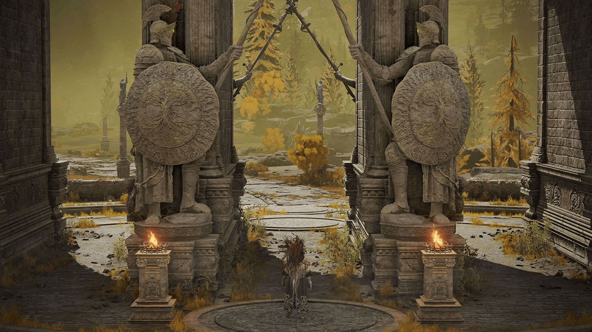
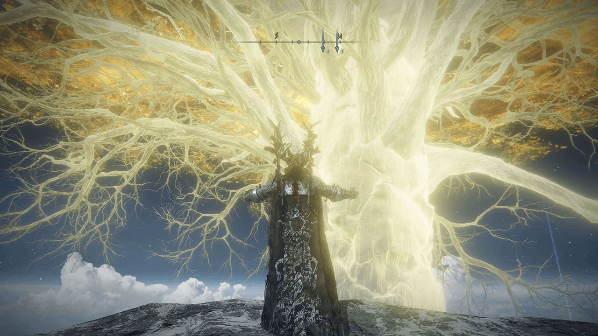
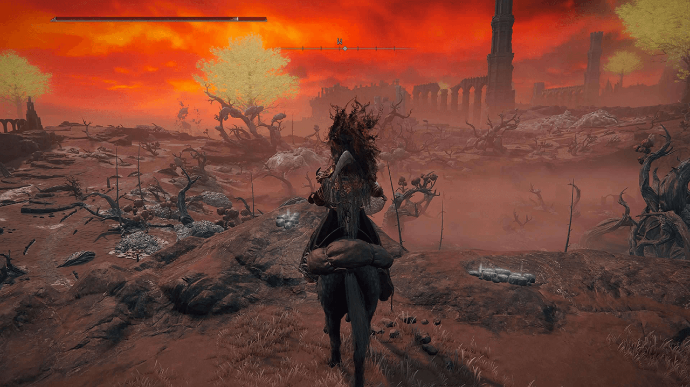
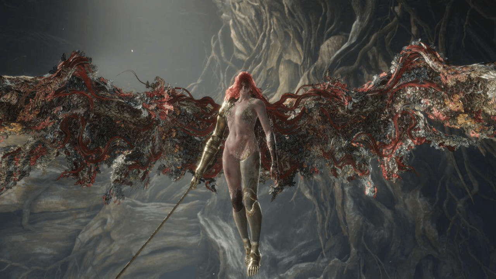

Elden Ring jest to gra, którą można kochać albo nienawidzić. Nie ma nic pośrodku. Albo człowiek wsiąka na 100 godzin, albo odbija się od pierwszej godziny gry. Ja zaliczam się do tej grupki, co zatraciły poczucie czasu i godność w zmaganiach z tą produkcją. Każda sekunda cierpienia, frustracji i szczypta kontrolowanego gniewu były tego warte, by przeżyć to wszystko. Ale czy to gra dla przeciętnego zjadacza cyfrowego chleba? 

Elden Ring został wyprodukowany przez From Software, czyli studio, które w tym momencie można nazwać legendarnym. Dla tych 2 osób, które spędziły życie w lasach albo jaskiniach, twórca ten jest odpowiedzialny za wydanie takich cudów jak: seria Dark Souls, gry Bloodborne, Sekiro. Delikatnie mówiąc, stworzyli oni osobny gatunek gier, który wcześniej nie istniał, albo nie był zbyt dominujący na rynku. Teraz co trzecia gra chce być “soulslike”, mając nadzieję, że zreprodukuje sukces Japońskiego studia. Dzięki temu zjeby jak ja, które lubią wyzwania i czerpią masochistyczną przyjemność z dręczenia swojego stanu psychicznego i pada, mają niemały wybór jeśli chodzi o “trudne” gry. Twórcy mali i duzi starają się wytworzyć coś ciekawego, co trafi do takiego niereformowalnego człowieka jak ja. Ale nie o nich w tym materiale. Wróćmy do Elden Ring…

W 2022 na rynek wypuścili swoje nowe IP i świat się po tym zesrał. Każdy grał i każdy czerpał niemałą przyjemność z tego. Jak zwykle pojawiły się dyskusje, czy ER powinien mieć tryb “łatwy”, bo gra jest za trudna (lecz wydaje mi się, że to materiał na kolejny artykuł). I tu powinienem przejść gładko do tego jak przez pierwsze 72 godziny od premiery, nie spałem i tylko grałem, ale tak idealnie to nie było. W czasie premiery byłem na urlopie i musiałem unikać informacji i spojlerów przez lekko ponad tydzień. O matko, jaka bieda była, nigdzie do internetu nie mogłem zajrzeć, bo spojlery, bo to i tamto. A ja chciałem sam wejść i doznać tego świata, jak wszystkie poprzednie, czyli goły, przestraszony i pełnen ekscytacji. Po tygodniu zmagań z syndromem odstawienia od internetu, udało się - konsola odpalona, gra się ładuje iiii…. Slap w uszy. Muzyka z menu piękna, podniosła, aż ocieka patosem i klimatem. Ah… warto było czekać. Tu rozpoczyna się przygoda, powtarzałem sobie. Miałem nadzieję, że będzie choć w 1% tak dobra jak było zapowiadane. I zdecydowanie nie zawiodła. Intro leci, mój wewnętrzny pięciolatek biega w głowie niczym kurczak bez głowy. Jest moc. Moim skromnym zdaniem Dark Souls 3 albo Bloodborn mają lepsze, intro ale co zrobić. Potem patos opada i wita nas edytor postaci. Jest rozbudowany, mnóstwo opcji, by móc w straszny sposób deformować naszego protagonistę. Totalnie takie rzeczy mi nie są potrzebne. Jedynie co ustawiłem, to by włosy mojej postaci były możliwie najbardziej świecące jak się da. Zawsze mnie to bawi, że ludzie spędzają w edytorze tyle czasu, gdy przez większość gry nasza laleczka nosi garnek na głowie. No ale wszystko jest dla ludzi.



Po wybraniu startowej klasy, lądujemy w małym kościółku i zaczyna się nasza przygoda. Jak to zwykło w grach studia From Software, w pierwszych 5 minutach gry jesteśmy skazani na okropną śmierć. Śmierć z czegoś, co wygląda jak mop, który zamiast dyndających frędzelków do mycia podłogi ma dyndające łapki. Fun. Na całe szczęście można wrócić do pana mopa, gdy już spędzimy parę rundek na siłce, by mu pokazać, kto teraz jest frajerem. Jest to jedno z lepszych uczuć. I będzie ono się powtarzać całą grę. Ale o tym za chwilę. Dopiero po poznaniu, gdzie nasze miejsce, jesteśmy przenoszeni do punkty, który można nazwać poradnikiem i początkiem gry. Czyli ciemnej jak noc jaskini, gdzie dostajemy naszą flaszeczkę do leczenia. No i tyle. Po zmierzeniu się z niezbyt trudnym bossem i opuszczeniu ciemnicy wita nas ono. Złote drzewo. I ziomek w białej masce, który obraża nas w co drugim zdaniu.

W tym momencie stoimy w tym, co jest największym atutem i jednocześnie przekleństwem tej gry, czyli otwarty świat. Dostajemy nieskrępowaną możliwość pójścia praktycznie wszędzie, gdzie cyfrowe oczy naszej postaci potrafią dosięgnąć. I bardzo szybko gra tłumaczy nam realia tego świata, poprzez niezwykle przyjacielską postać jaką jest “Strażnik Drzewa”. Jak nam chłopaczyna pierdyknie z kija to aż po drugiej stronie ekranu to czuć. Dzięki czemu w naszych małych główkach szybko powinien pojawić się komunikat, “a co jeśli go oleje i wrócę tu?”. I nic. Właśnie to jest to piękno tego świata. Widzisz przeciwnika, który jest dla ciebie za silny? Obejdź go. Nie da się? To idź gdzieś indziej i tu wróć za jakiś czas. Dostajemy nieskrępowaną możliwość zwiedzania całego otaczającego świata, pełnego smutku i śmierci. Co może być lepsze? Oczywiście dostajemy jakieś mgliste wskazówki, gdzie należy pójść, by kontynuować fabułę, jednak nie jest to forma jebitnej strzałki na mapie (jak w co niektórych grach), tylko dostajemy sugestie od niejednego NPC na drodze typu “widzisz ten wielki jak cholera zamek na wzgórku? Może jest to słabo przekazane, ale jest on ważny. Idź tam”.

By mierzyć się ze ścierwami dnia codziennego, Elden Ring zapewnia nam cały arsenał wszelakich broni. Od sztyletów zaczynając, a na wielkich palcach kończąc. Każda taka zabawka posiada unikatowe umiejętności i potrzebuje innego podejścia do samej zabawy. Jeśli nie odpowiada wam bicie pałką wszystkiego co się rusza, to oczywiście jest inna droga. Magia i inkantacje. Jedno i drugie ma swój zestaw odjechany czarów, jak i inkantacji, które można wybierać i wybierać. Gdy mamy kogoś serdecznie dość, nic nie stoi na przeszkodzie, by przyłożyć takiemu jegomościowi kometą, bądź czymś równie wyszukanym np. wielkim głazem. Natomiast, gdy nasza wewnętrzna bestia domaga się trochę powietrza, można przywołać sobie głowę smoka, co narzyga na naszych adwersarzy trucizną, ogniem bądź czymś innym. Do wyboru do koloru. Ja preferuje biegać z wielką bryłą metalu. Jednak ilość zaklęć zachęca, bym przeszedł całą grę jeszcze raz, wykorzystując głównie abra kadabra.

Elden Ring można podzielić na 3 rodzaje rozgrywki. Pierwszym jest otwarty świat, czyli po prostu świat, który jest otwarty i pozwala na bieganie w prawo i w lewo. Podoba ci się co widzisz przed tobą? Możesz tam iść. Dostajesz po pośladkach w lokacji, do której trafiłeś? No to dupa w troki i znikasz. Na mapie jest rozmieszczone mnóstwo ruin, pomniejszych budowli i ciekawych miejsc, które możemy sobie zwiedzać w komfortowym dla nas tempie. Świat jest różnorodny i ciekawy. Każdy zakątek mapy nagradza naszą ciekawość przedmiotem, czarem czy innym badziewiem, co pomoże nam albo przerwać, albo zadawać ból innym wesołym mieszkańcom krainy. Nie raz zdarza nam się też napotkać wielkiego skurwiesyna, który nie jest zadowolony z naszego widoku i wielką pałką, kulą ognia, bądź innym środkiem prosi nas o opuszczenie jego posesji.

Z otwartego świata bardzo płynnie można przejść do 2 typu rozgrywki, czyli do lochów, rozmieszczonych dosłownie wszędzie. Nie są one częścią głównej fabuły i można powiedzieć, że służą jako dopełniacz całego świata. Niestety polskie słowo “loch” bardzo zamyka naszą wyobraźnie na korytarze pełne szkieletów i masą trumien wszelakiego rodzaju. I lochy tego typu również się tu znajdują. Ale są też inne takie jak kopalnie, tunele (kopalnia nie równa się tunel), krypty oraz grobowce pradawnych bohaterów. Każde z nich mają swoją własną estetykę i prawa rządzące nimi. W katakumbach są szkielety, w kopalniach górnicy itd. Każdy taki loch ma w swoim centrum mini bossa i zabicie go kończy się zdobyciem czegoś. Przejście jednego lochu to przeważnie od 30 minut do 1h grania. Wszystko zależy od wielkości i jak szybko szefuncia zabijemy.

I ta część gry moim zdaniem jest najsłabsza. Elden Ring chwali się tym, że oferuje ponad 150 bossów do podbicia i duża ich większość jest właśnie we wszelakiego rodzaju pieczarach i cierpliwie na nas czeka z kanapeczkami i herbatką. Na papierze to brzmi fajnie, 150, ojej jak dużo. Ale lochy bardzo szybko się nudzą. Stają się powtarzalne i nie dają mega frajdy na zwiedzanie ich. Natomiast co do bossów, to nie jestem wstanie zliczyć, ile razy zabiłem tych samych typów. O matko polko i Jezusku w klapkach, zabiłem z 10 Dyniogłowych, jak nie więcej. To powinno dać jakiś obraz tego, jak często bossowie są po prostu wykorzystani na nowo, niczym szary papier toaletowy. Na szczęście takie lochy są czymś z gwiazdką, czyli dla chętnych. Niestety zawierają jednak masę przydatnego żelastwa. Więc czasem trzeba zacisnąć pośladki i po raz 100 szukać wajchy, by tylko otworzyć drzwi do bossa, by go szybko zabić. By to było jasne, twórcy starają się, by każdy loch był w jakiś sposób unikalny, ale moim zdaniem wychodzi to średnio.



No i ostatni rodzaj rozgrywki, to są główne lochy. Czyli wielkie lokacje, w których rezyduje jakiś wielki dzban. Przybierają one różne formy, od zamków, po miasta jak i domek na drzewie. I tu tak naprawdę jest całe uroczę fabularne mięso tej gry. W nich mierzymy się z bossami, co są o 10 klas wyżej, niż wszystko, co wcześniej spotkaliśmy na swej drodze. Każdy taki loch ma swoją własną historię i styl, przez co nie da się ich pomylić z niczym innym. Wszyscy fani wcześniejszych produkcji studia, będą się czuli tu jak ryba w wodzie, albo jak parówka w bułce. Są to zamknięte przestrzenie, pełne skrótów i wszelakich wyzwań, które mają nas zachęcić do zakończenia grania. Co do bossów, to lekką ręką można powiedzieć, że każdy z nich jest cudowny na inny sposób. Czy to, jak każe nas serią tryliona ciosów na sekundę, czy jak po prostu postanowi się po nas przeturlać. To co jest raczej mało dziwne, nie każdy jest równie wymagający. Są jednostki, jak pewna gnijąca pani, co będzie nas łechtała swoim mieczem pewnie przez jakieś 100 podejść (ja potrzebowałem zaledwie 78 prób), ale trafiają się też jednostki pokroju wielkiego ognistego giganta, który przeważnie umiera na jakiś pierwszym albo drugim podejściu. Jednak siłę nadrabia wyglądem. O tym złego słowa powiedzieć nie mogę. Dla mnie osobiście najbardziej przyjemne walki to były z postaciami, które były gabarytów mojej postaci albo niewiele większe. Większość dużych bossów jednak ma to do siebie, że nie mieści się na ekranie i przez co kamera szaleje, co dodaje dodatkowe nieprzyjemne doznania. Więc Panowie, wielkość ma znaczenie.

Nie można pisać, czy mówić o Elden Ringu, nie wspominając o fabule tej gry. Jest ona świetna. Tyle. W przeciwieństwie do wcześniejszych gier (z wyjątkiem Sekiro) fabuła nie wymaga od gracza czytania każdego znalezionego skrawka materiału, czy majtek, by dowiedzieć się co właściwie się odjaniepawla w tym świecie. Oczywiście opisy przedmiotów, poszerzają to wszystko, jednak podstawowy zarys fabularny można zrozumieć z cutscenek czy z rozmów z postaciami niezależnymi. Uważam, że sposób prezentacji jest w sam raz. Mówią ci trochę, kogo masz zabić i kim on jest, a z dodatkowych opisów możesz dowiedzieć się, dlaczego ziomkowi odwaliło i musiałeś go zabić. Nie trzeba od razu po przejściu gry, czy też szturmować Youtuba. Jednak nie uznaje tego za nic złego i sam korzystam usług youtuberów, by poszerzyć moją wiedzę o tej grze. 

Samo to, że spędziłem w tej grze prawie 100 godzin z mojego życia powinno być dowodem na to, jaka to cudowna produkcja. Muzyka jak zawsze robi 1/3 roboty w całej grze. Każda ścieżka do bossa dodaje patosu i buduje dodatkowe napięcie. Każde główny boss jest dobrze zaprojektowany i gdy umieramy, to prawie zawsze sprowadza się do tego, że to my ssiemy. Mogę jedynie polecić tę produkcję każdemu. Gra daje możliwość dostosowania tempa oraz stylu w jakim gramy do naszego widzimisie. Ktoś woli ataki dystansowe to, jest cały wachlarz czarów, a jak ktoś (jak ja) woli podchodzi blisko oponentów, to też znajdzie ulubione narzędzie do zadawania bólu. Trzeba jednak powiedzieć, że gra jest wymagająca. Daje jednak możliwości ułatwienia rozgrywki, poprzez przywołanie postaci niezależnych, czy innych graczy. Dlatego, jak choć trochę jesteś zainteresowanym całym tym światem, to nie powstrzymuj się. Jest to gra, która stanowi idealne wejście do wszystkich gier studia From Software. Kurde! Od samego pisania tego, zachciało mi się włożyć płytę do konsoli i pograć trochę, to znak że trzeba kończyć. Nara.
